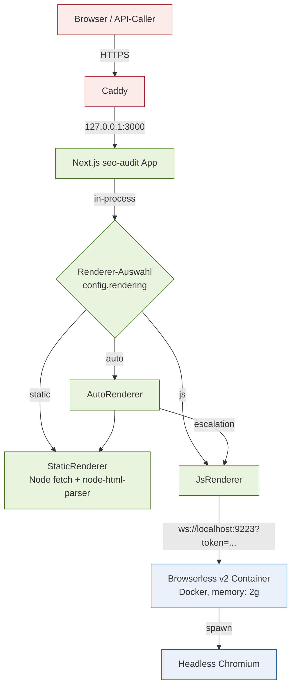

# Headless-Browser-Architektur

Dieses Dokument konsolidiert die verstreuten Architektur-Erklärungen rund
um den Headless-Browser-Stack des SEO-Audits (Phase E der Roadmap).
Entscheidungs-Begründungen, Komponenten-Topologie, Datenfluss und
bekannte Limitationen — alles an einem Ort. Step-by-Step-Deployment
bleibt in [`DEPLOYMENT.md §2b`](../../DEPLOYMENT.md) und
[`infra/browserless/README.md`](../../infra/browserless/README.md);
diese Doku referenziert, wiederholt nicht.

## 1. Überblick — Warum überhaupt Headless?

Ein nennenswerter Teil moderner Websites rendert seinen Hauptinhalt erst
client-seitig. Eine reine Static-Fetch-Audit-Pipeline (HTTP-Get + HTML-
Parser) sieht bei diesen Sites nur die Skeleton-Shell: leere `<div id="root">`
und ein `<script>`-Bundle. Das deckt sich mit dem, was AI-Retrieval-Bots,
Social-Preview-Crawler und ältere Suchmaschinen tatsächlich sehen — aber
nicht mit dem, was ein Nutzer im Browser sieht.

Konkret können folgende Audit-Aspekte ohne JS-Render **nicht** geprüft
werden:

- **CSR-Sichtbarkeit:** Ist nach Hydration noch Inhalt da, der vorher fehlte?
  Wie groß ist der Unterschied?
- **JS-Console-Errors:** Welche Skripte werfen Fehler beim Hochfahren?
- **Sub-Resource-Failures:** Welche `<script>` / `<link>` / `<fetch>`-Calls
  brechen 4xx/5xx oder Network-Layer?
- **DOM-basierte Accessibility:** axe-core läuft auf dem gerendertem DOM,
  nicht auf dem Static-HTML.
- **Touch-Target-Boxen, Sichtbarkeits-Diff Mobile vs. Desktop:** beides
  braucht echte Layout-Information.
- **Screenshots:** Mobile + Desktop für den PDF-Export.

Phase E bringt einen Headless-Chromium dazwischen, ohne den Static-Pfad
zu opfern. Welche Pages den Browser tatsächlich brauchen, entscheidet
der `auto`-Modus pro Seite.

## 2. Renderer-Modi

`AuditConfig.rendering` ist tri-modal: `'static' | 'js' | 'auto'`. Das
ist eine Audit-Config-Ebene; pro gerenderter Page bleibt der Output-Mode
binär (`'static' | 'js'`) — `auto` ist die Selektions-Strategie, kein
Page-Result-State.

| Modus | Wann wählen | Verhalten |
|---|---|---|
| `static` | Kleine MVP-Audits, statische Sites, billig + schnell | Plain HTTP-Fetch, kein Browserless. Keine axe, keine Screenshots, kein renderTimeMs. |
| `js` | Bekannte SPAs, axe gewünscht, Screenshots gewünscht | Jede Page durch Browserless. Teurer (~2-5s pro Page) aber vollständige Datenlage. |
| `auto` (Default) | Unbekannte oder gemischte Sites | Static-First; CSR-Heuristik entscheidet pro Page, ob auf JS eskaliert wird. |

### Wie `auto` arbeitet

```
┌────────────────────────┐
│ AutoRenderer.fetch(url)│
└──────────┬─────────────┘
           ▼
   StaticRenderer.fetch ── 200 OK ──► HTML
           │                          │
           │                          ▼
           │               detectCsrFromHtml(html)
           │                          │
           │            ┌─────────────┴─────────────┐
           │            ▼                           ▼
           │   likelyClientRendered=true   likelyClientRendered=false
           │            │                           │
           │            ▼                           │
           │   JsRenderer.fetch(url) ──► RenderResult
           │            │
           │            ▼
           └────► return RenderResult
```

Die Heuristik (`util/csr-detection.ts`) prüft zwei Signale:

1. **SPA-Root-Container leer:** `#root`, `#app`, `#__next`, `#___gatsby`,
   `#__nuxt`, `[data-reactroot]` mit innerText < 100 Zeichen.
2. **Body fast leer + substanzielles `<noscript>`:** body wordCount < 30
   bei `<noscript>` mit > 50 Zeichen Text.

Trifft eines, wird auf JS-Render eskaliert.

**Trade-off:** der Static-First-Pfad eskaliert mit einem **doppelten
Static-Fetch**, weil `JsRenderer.fetch()` intern parallel sein eigenes
Static-Probe für den Static-vs-Rendered-Diff laufen lässt. Das sind
~100-200 ms zusätzlich pro eskalierter Page — Architektur-Klarheit
gewinnt gegen den Mikro-Optimierungs-Refactor (siehe Sektion 9).

Pages mit Status ≥ 400 werden nicht eskaliert: ein 404 wird durch
JS-Render nicht zu einem 200, und die meisten Error-Pages sind eh leer
genug, um die Heuristik fälschlicherweise auszulösen.

## 3. Browserless als Process-Boundary

Drei Optionen wären denkbar gewesen — Browserless-Container ist die
gewählte:

| Option | Ergebnis |
|---|---|
| Playwright in-process im Next.js-Server | Keine Process-Isolation. Eine OOM-Schleife im Chromium killt den ganzen Audit-Service. Memory-Leaks akkumulieren über Audits hinweg. |
| Externer SaaS (ScrapingBee, Browserless.io Cloud, …) | Daten verlassen die Infrastruktur — DSGVO-Problem für Audits auf Kunden-URLs mit Tracking-Skripten / Cookies. Kosten skalieren mit Request-Volumen statt mit Bedarf. |
| **Browserless v2 als lokaler Docker-Container** | Process-Isolation per Container. OOM-Limit erzwungen (`memory: 2g`). DSGVO-konform — alle Daten bleiben auf twb-server. Skaliert horizontal über mehrere Instanzen, falls nötig. |

Browserless ist bewusst **als Service-Boundary, nicht als Library**
eingebunden. Der Audit-Service kommuniziert über das WebSocket-Playwright-
Protokoll (`ws://localhost:9223?token=…`); kein gemeinsamer Speicher.
Das macht Container-Restarts (geplant oder OOM-getriggert) unsichtbar
für laufende Audits, solange der einzelne Audit nicht gerade in der
Mitte eines Page-Renders ist.

## 4. Topologie

Beide Container leben auf demselben Host (twb-server, Hetzner CPX32),
kommunizieren über localhost-Bindings — keine externen Hops, kein
Caddy-Proxy zwischen ihnen.



Browserless bindet `127.0.0.1:9223` → intern `:3000`. Caddy proxy't den
Container nie nach außen — der Token im WebSocket-Query ist Defence-in-
Depth, nicht die primäre Sicherheitsgrenze.

## 5. Renderer-Abstraktion

Code-Layout unter [`src/lib/renderer/`](../../src/lib/renderer/):

| Datei | Inhalt |
|---|---|
| [`types.ts`](../../src/lib/renderer/types.ts) | `Renderer`-Interface, `RenderResult`-Type, `RendererOptions`. |
| [`static.ts`](../../src/lib/renderer/static.ts) | `StaticRenderer` — Node `fetch` mit Redirect-Tracking, Header-Build, Protocol-Detection-Heuristik. |
| [`js.ts`](../../src/lib/renderer/js.ts) | `JsRenderer` — Browserless-Client. Parallel-Static-Probe für den Diff, lazy Browser-Connect, axe-Hook. |
| [`auto.ts`](../../src/lib/renderer/auto.ts) | `AutoRenderer` — komponiert `StaticRenderer` + `JsRenderer`, eskaliert pro Page nach CSR-Check. |
| [`index.ts`](../../src/lib/renderer/index.ts) | Re-Exports + `probeBrowserless` für die Health-Vorprüfung im Route-Handler. |

Alle drei Renderer implementieren das gleiche Interface:

```ts
interface Renderer {
  readonly mode: 'static' | 'js' | 'auto';
  fetch(url: string): Promise<RenderResult>;
  close(): Promise<void>;
}
```

`RenderResult.mode` bleibt `'static' | 'js'`. `auto` ist nur als
`Renderer.mode` sichtbar — auf der Result-Ebene ist jede Page entweder
static oder js gerendert.

Konstruktion erfolgt im Route-Handler (`src/app/api/audit/route.ts`)
abhängig von `config.rendering`. Browserless wird vor SSE-Stream-Open
einmal geprobed (`probeBrowserless`); im `js`- und `auto`-Modus
gleichermaßen — beide brauchen den Container reachable.

## 6. Datenfluss + persistierte Felder

Was der JS-Render-Pfad in `PageData` / `PageSEOData` einträgt:

| Feld | Typ | Quelle | Zweck |
|---|---|---|---|
| `staticHtml` | `string?` | StaticRenderer im Parallel-Probe | Snapshot vor Hydration für Diff. |
| `staticWordCount` | `number?` | `countVisibleWords(staticHtml)` | Vergleichs-Metrik. |
| `renderTimeMs` | `number?` | `goto + content`-Dauer (ohne axe) | Performance-Diagnostik. |
| `staticVsRenderedDiff` | `StaticVsRenderedDiff?` | `computeRenderDiff(staticHtml, …, renderedHtml)` | Word- und Link-Count-Deltas + Ratio. Treibt `hydration-mismatch-suspected`. |
| `httpErrors` | `HttpError[]?` | Browserless `response`-Listener auf Status ≥ 400, sub-resources only | 4xx/5xx-Detection auf CSS/JS/XHR/Fetch. |
| `failedRequests` | `string[]?` | Browserless `requestfailed`-Listener | Network-Layer-Failures (DNS, CORS, ABORT). |
| `consoleErrors` | `string[]?` | Browserless `pageerror` + `console`-Errors | JS-Errors zur Render-Zeit. |
| `axeViolations` | `AxeViolation[]?` | `@axe-core/playwright` (nur wenn Modul aktiv) | Accessibility-Befunde mit Schweregrad-Mapping. |
| `likelyClientRendered`, `clientRenderSignal` | `boolean`, `string?` | `detectCsrFromRoot` im Extractor | CSR-Detection-Output, identisch zu der Heuristik die `AutoRenderer` für Eskalation nutzt. |
| `screenshots` (auf `AuditResult`-Ebene) | Mobile + Desktop Base64 | `JsRenderer.captureScreenshot` | PDF-Export-Anhang, nur bei `rendering=js`. |

Static-Mode-Pages kriegen die `js`-spezifischen Felder als `undefined`.
Auto-Mode-Pages OHNE Eskalation auch — sie sind funktional Static-Pages.
Auto-Mode-Pages MIT Eskalation kriegen die volle JS-Datenlage.

`httpErrors` und `failedRequests` sind komplementär: Playwright feuert
für einen einzelnen Request entweder `response` (HTTP-Layer) ODER
`requestfailed` (Network-Layer), nie beides. E5-Findings konsumieren
beide Listen kombiniert.

## 7. Findings, die Headless-Daten konsumieren

| Finding | Datei | Datenbasis |
|---|---|---|
| `js-rendering-required` | [`tech.ts:682+`](../../src/lib/findings/tech.ts) (in `generateJsRenderingFindings`) | `staticWordCount` vs. `wordCount`. |
| `js-console-errors` | [`tech.ts:682+`](../../src/lib/findings/tech.ts) (gleiche Funktion) | `consoleErrors`. |
| `failed-network-requests` | [`tech.ts:682+`](../../src/lib/findings/tech.ts) | `httpErrors` + `failedRequests` kombiniert; Same-Origin + Critical-Resource → Important. |
| `hydration-mismatch-suspected` | [`tech.ts:682+`](../../src/lib/findings/tech.ts) | `staticVsRenderedDiff`-Schwellen (Word-Loss-Ratio, Link-Loss-Delta). |
| Accessibility-Findings (axe) | [`accessibility.ts:42`](../../src/lib/findings/accessibility.ts) | `axeViolations`-Cluster pro Severity. |
| `mobile-desktop-parity` | [`seo.ts:1512`](../../src/lib/findings/seo.ts) | Eigener Pfad: zwei Static-Fetches mit `googlebot-mobile` + `googlebot-desktop`-UAs. **Nutzt Browserless nicht.** |

Mobile/Desktop-Parität ist bewusst Static-Only: das User-Agent-Switching
liefert ohne Browserless schon brauchbare Aussagen über Server-Side-
Differenzen, und Browserless für jede Sample-Page doppelt zu fahren wäre
unverhältnismäßig teuer.

## 8. Deployment

Schritt-für-Schritt-Anleitungen in:

- [`DEPLOYMENT.md §2b`](../../DEPLOYMENT.md) — Browserless-Section
  innerhalb der Server-Setup-Doku.
- [`infra/browserless/README.md`](../../infra/browserless/README.md) —
  First-Time-Setup, Token-Sync zwischen den beiden `.env`-Dateien,
  systemd-Unit-Install, Day-to-Day-Operations, Image-Upgrade-Workflow.
- [`infra/browserless/browserless.service`](../../infra/browserless/browserless.service)
  — das Unit-File selbst.
- [`infra/browserless/docker-compose.yml`](../../infra/browserless/docker-compose.yml)
  — Container-Definition (Image-Pin, Memory-Cap, Healthcheck, Localhost-Binding).

## 9. Bekannte Limitationen / Future Work

- **Doppelter Static-Fetch im Auto-Eskalations-Pfad.** `AutoRenderer`
  fetcht static, dann eskaliert auf `JsRenderer.fetch`, der intern
  parallel nochmal static probed (für den Diff). Pro eskalierter Page
  ~100-200 ms Overhead. Optimierung wäre ein API-Refactor des
  `JsRenderer`, der einen optionalen pre-computed `staticHtml` als Input
  akzeptiert. Bewusst nicht gemacht — Architektur-Klarheit gewinnt
  gegen die Mikro-Optimierung.

- **Renderer-File-Naming abweichend von der ursprünglichen E2-Spec.**
  Spec nannte `interface.ts`, `browserless.ts`, `factory.ts`; tatsächlich
  sind es `types.ts`, `js.ts` und keine separate `factory.ts`
  (Komposition passiert direkt im Route-Handler). Pragmatisch ok, der
  `Renderer`-Interface-Vertrag ist trotzdem stabil.

- **Screenshots nur in `js`-Modus, nicht in `auto`-Modus.** Per-Page-
  Screenshot-Capture für eskalierte Auto-Pages wäre möglich, würde aber
  die Renderer-API erweitern (`captureScreenshot` müsste in `Renderer`-
  Interface, oder `AutoRenderer` müsste den embedded `JsRenderer`
  rausreichen). UX-Refinement, nicht priorisiert.

- **Touch-Targets-Detection (D1) ist heuristisch.** Aktuell zählt der
  Extractor inline-styled `<a>` / `<button>`-Elemente mit Sichtbarkeits-
  Indikatoren < 48×48 px. Eine Browserless-basierte Lösung könnte
  tatsächliche `getBoundingClientRect()`-Werte liefern — Code-Comment in
  `util/touch-targets.ts` markiert den Punkt. Out of Scope solange die
  Heuristik in Praxis brauchbar ist.

- **CSR-Detection-Heuristik ist konservativ.** Empirisch tunen, wenn
  False-Positives (Auto eskaliert ohne Notwendigkeit) oder False-
  Negatives (Auto bleibt static auf einer SPA) auftreten. Konstanten in
  `util/csr-detection.ts` (`SPA_ROOT_TEXT_THRESHOLD`,
  `LOW_WORD_COUNT_THRESHOLD`, `NOSCRIPT_TEXT_THRESHOLD`) sind benannt
  und kommentiert.
